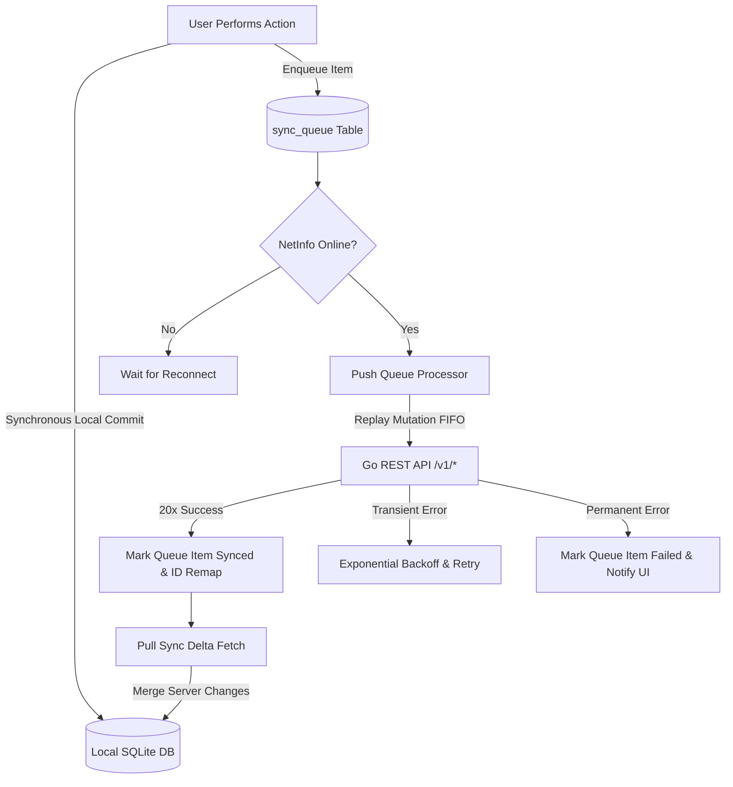

# Personal Tasks + Notes + Money — Mobile Technical Architecture & Plan (`MOBILE_AGENT.md`)

## Technical Architecture Overview

The mobile client is an Android application located in `/mobile` within the monorepo. It interfaces with the existing Go backend (`/v1/*`) and Supabase Postgres/Storage instance. 

The architecture is built around an **Offline-First Storage Engine**: all domain reads and writes target a local SQLite database (`expo-sqlite`), while an asynchronous **Sync Engine** reconciles local mutations with the Go API using an idempotent, ordered queue processor.

---

## Tech Stack & Framework Decision

- **Framework**: React Native with **Expo Managed Workflow** (SDK 51/52+).
  - *Justification*: Expo provides production-ready, highly optimized native modules for offline SQLite (`expo-sqlite`), secure credential storage (`expo-secure-store`), camera/gallery access (`expo-image-picker`), sandboxed filesystem management (`expo-file-system`), and network state monitoring (`@react-native-community/netinfo`). Using Expo Managed Workflow eliminates native Android Gradle/C++ setup complexity while enabling cross-platform expansion in the future. Ejecting to bare React Native is unnecessary as all required native capabilities are natively covered by Expo modules.
- **UI Components & Styling**: React Native core components (`View`, `Text`, `Pressable`, `FlatList`) with custom TypeScript styling tokens mirroring `frontend/src/styles/tokens.css`.
- **Navigation**: React Navigation (Native Stack + Bottom Tabs) or Expo Router.
- **Local Database**: `expo-sqlite` (version 14+ with modern async/sync transaction support and SQLite WAL mode enabled).
- **Secure Storage**: `expo-secure-store` for storing local-admin JWT tokens securely in Android `EncryptedSharedPreferences`.
- **Network State**: `@react-native-community/netinfo` for real-time cellular/Wi-Fi connection detection.

---

## Folder & Workspace Structure

The mobile project lives under `/mobile` alongside `/frontend` and `/backend`:

```text
tasker/
  api/
    openapi.yaml
  backend/
  frontend/
  mobile/
    App.tsx
    app.json
    package.json
    tsconfig.json
    src/
      db/
        database.ts           # SQLite connection pool & initialization
        schema.ts             # DDL table creation scripts & indexes
        migrations.ts         # Schema versioning & migration runner
        repositories/         # Typed local SQLite CRUD operations
          taskLocal.ts
          noteLocal.ts
          moneyLocal.ts
          queueLocal.ts
      sync/
        syncEngine.ts         # Main sync controller orchestrating push & pull
        queueProcessor.ts     # FIFO queue replay engine with error classification
        pullSync.ts           # Delta pull sync & timestamp merge handler
        netInfoListener.ts    # Connectivity listener & auto-trigger
        idRemapper.ts         # Translates local temporary UUIDs to server UUIDs
      services/
        apiClient.ts          # Typed HTTP fetch wrapper for Go backend /v1/* API
        authService.ts        # Secure store JWT management & login flow
      features/
        auth/                 # Mobile login screen & pin guard
        tasks/                # Task list, task editor, project/tag pickers
        notes/                # Note list, Markdown editor/preview, image capture
        money/                # Accounts, transactions, categories, budgets, recurring
        sync/                 # Sync status bar, queue drawer, failed item resolution UI
      shared/
        components/           # Reusable UI controls (Card, Badge, Button, Input, Modal)
        hooks/                # React hooks subscribing to local SQLite updates
        types/                # Shared TypeScript DTO contracts mapped from openapi.yaml
        utils/                # Date formatting, currency formatters, Markdown helpers
```

---

## Local Database Schema (`expo-sqlite`)

The local database mirrors server domain tables and adds `is_deleted` flags for soft deletion, plus operational sync tables (`sync_queue` and `sync_metadata`).

### SQLite Pragmas
```sql
PRAGMA journal_mode = WAL;
PRAGMA foreign_keys = ON;
```

### Table Definitions

#### 1. Operational Sync Tables

```sql
CREATE TABLE IF NOT EXISTS sync_queue (
  id INTEGER PRIMARY KEY AUTOINCREMENT,
  entity_type TEXT NOT NULL,          -- 'task', 'note', 'transaction', 'account', etc.
  entity_id TEXT NOT NULL,            -- Local UUID of the record
  operation TEXT NOT NULL,            -- 'CREATE', 'UPDATE', 'DELETE', 'UPLOAD_IMAGE', 'UPLOAD_RECEIPT'
  payload TEXT NOT NULL,              -- JSON serialized DTO
  created_at TEXT NOT NULL,           -- ISO 8601 UTC timestamp
  retry_count INTEGER DEFAULT 0,
  last_error TEXT NULL,
  status TEXT DEFAULT 'pending'       -- 'pending', 'processing', 'failed'
);

CREATE TABLE IF NOT EXISTS sync_metadata (
  table_name TEXT PRIMARY KEY,
  last_synced_at TEXT NOT NULL,
  sync_cursor TEXT NULL
);
```

#### 2. Tasks Module

```sql
CREATE TABLE IF NOT EXISTS projects (
  id TEXT PRIMARY KEY,
  name TEXT NOT NULL,
  color TEXT NULL,
  is_archived INTEGER DEFAULT 0,
  created_at TEXT NOT NULL,
  updated_at TEXT NOT NULL,
  is_deleted INTEGER DEFAULT 0
);

CREATE TABLE IF NOT EXISTS tags (
  id TEXT PRIMARY KEY,
  name TEXT NOT NULL,
  color TEXT NULL,
  created_at TEXT NOT NULL,
  updated_at TEXT NOT NULL,
  is_deleted INTEGER DEFAULT 0
);

CREATE TABLE IF NOT EXISTS tasks (
  id TEXT PRIMARY KEY,
  title TEXT NOT NULL,
  description TEXT NULL,
  status TEXT NOT NULL DEFAULT 'open',
  completed_at TEXT NULL,
  due_date TEXT NULL,
  priority INTEGER DEFAULT 0,
  project_id TEXT NULL,
  created_at TEXT NOT NULL,
  updated_at TEXT NOT NULL,
  is_deleted INTEGER DEFAULT 0,
  FOREIGN KEY (project_id) REFERENCES projects(id) ON DELETE SET NULL
);

CREATE TABLE IF NOT EXISTS subtasks (
  id TEXT PRIMARY KEY,
  task_id TEXT NOT NULL,
  title TEXT NOT NULL,
  completed INTEGER DEFAULT 0,
  position INTEGER DEFAULT 0,
  created_at TEXT NOT NULL,
  updated_at TEXT NOT NULL,
  is_deleted INTEGER DEFAULT 0,
  FOREIGN KEY (task_id) REFERENCES tasks(id) ON DELETE CASCADE
);

CREATE TABLE IF NOT EXISTS task_tags (
  task_id TEXT NOT NULL,
  tag_id TEXT NOT NULL,
  created_at TEXT NOT NULL,
  PRIMARY KEY (task_id, tag_id),
  FOREIGN KEY (task_id) REFERENCES tasks(id) ON DELETE CASCADE,
  FOREIGN KEY (tag_id) REFERENCES tags(id) ON DELETE CASCADE
);
```

#### 3. Notes Module

```sql
CREATE TABLE IF NOT EXISTS notes (
  id TEXT PRIMARY KEY,
  title TEXT NOT NULL,
  content_md TEXT NOT NULL DEFAULT '',
  created_at TEXT NOT NULL,
  updated_at TEXT NOT NULL,
  is_deleted INTEGER DEFAULT 0
);

CREATE TABLE IF NOT EXISTS note_tags (
  note_id TEXT NOT NULL,
  tag_id TEXT NOT NULL,
  created_at TEXT NOT NULL,
  PRIMARY KEY (note_id, tag_id),
  FOREIGN KEY (note_id) REFERENCES notes(id) ON DELETE CASCADE,
  FOREIGN KEY (tag_id) REFERENCES tags(id) ON DELETE CASCADE
);

CREATE TABLE IF NOT EXISTS note_task_links (
  note_id TEXT NOT NULL,
  task_id TEXT NOT NULL,
  created_at TEXT NOT NULL,
  PRIMARY KEY (note_id, task_id),
  FOREIGN KEY (note_id) REFERENCES notes(id) ON DELETE CASCADE,
  FOREIGN KEY (task_id) REFERENCES tasks(id) ON DELETE CASCADE
);

CREATE TABLE IF NOT EXISTS note_images (
  id TEXT PRIMARY KEY,
  note_id TEXT NOT NULL,
  bucket_id TEXT NOT NULL DEFAULT 'note-images',
  object_path TEXT NULL,
  local_uri TEXT NOT NULL,
  original_filename TEXT NOT NULL,
  mime_type TEXT NOT NULL,
  byte_size INTEGER NOT NULL,
  alt_text TEXT NULL,
  width INTEGER NULL,
  height INTEGER NULL,
  created_at TEXT NOT NULL,
  sync_status TEXT DEFAULT 'pending', -- 'pending', 'uploading', 'synced', 'failed'
  FOREIGN KEY (note_id) REFERENCES notes(id) ON DELETE CASCADE
);
```

#### 4. Money Module

```sql
CREATE TABLE IF NOT EXISTS accounts (
  id TEXT PRIMARY KEY,
  name TEXT NOT NULL,
  account_type TEXT NOT NULL,
  currency TEXT NOT NULL DEFAULT 'IDR',
  archived_at TEXT NULL,
  created_at TEXT NOT NULL,
  updated_at TEXT NOT NULL,
  is_deleted INTEGER DEFAULT 0
);

CREATE TABLE IF NOT EXISTS categories (
  id TEXT PRIMARY KEY,
  name TEXT NOT NULL,
  category_type TEXT NOT NULL,
  icon TEXT NULL,
  color TEXT NULL,
  archived_at TEXT NULL,
  created_at TEXT NOT NULL,
  updated_at TEXT NOT NULL,
  is_deleted INTEGER DEFAULT 0
);

CREATE TABLE IF NOT EXISTS transactions (
  id TEXT PRIMARY KEY,
  transaction_type TEXT NOT NULL,
  amount REAL NOT NULL,
  transaction_date TEXT NOT NULL,
  account_id TEXT NOT NULL,
  transfer_account_id TEXT NULL,
  category_id TEXT NULL,
  description TEXT NULL,
  created_at TEXT NOT NULL,
  updated_at TEXT NOT NULL,
  is_deleted INTEGER DEFAULT 0,
  FOREIGN KEY (account_id) REFERENCES accounts(id) ON DELETE RESTRICT,
  FOREIGN KEY (transfer_account_id) REFERENCES accounts(id) ON DELETE RESTRICT,
  FOREIGN KEY (category_id) REFERENCES categories(id) ON DELETE RESTRICT
);

CREATE TABLE IF NOT EXISTS transaction_receipts (
  id TEXT PRIMARY KEY,
  transaction_id TEXT NOT NULL UNIQUE,
  bucket_id TEXT NOT NULL DEFAULT 'note-images',
  object_path TEXT NULL,
  local_uri TEXT NOT NULL,
  original_filename TEXT NOT NULL,
  mime_type TEXT NOT NULL,
  byte_size INTEGER NOT NULL,
  width INTEGER NULL,
  height INTEGER NULL,
  created_at TEXT NOT NULL,
  sync_status TEXT DEFAULT 'pending',
  FOREIGN KEY (transaction_id) REFERENCES transactions(id) ON DELETE CASCADE
);

CREATE TABLE IF NOT EXISTS budgets (
  id TEXT PRIMARY KEY,
  category_id TEXT NOT NULL,
  period_start TEXT NOT NULL,
  period_end TEXT NOT NULL,
  amount_limit REAL NOT NULL,
  created_at TEXT NOT NULL,
  updated_at TEXT NOT NULL,
  is_deleted INTEGER DEFAULT 0,
  FOREIGN KEY (category_id) REFERENCES categories(id) ON DELETE RESTRICT
);

CREATE TABLE IF NOT EXISTS recurring_transactions (
  id TEXT PRIMARY KEY,
  transaction_type TEXT NOT NULL,
  amount REAL NOT NULL,
  account_id TEXT NOT NULL,
  category_id TEXT NOT NULL,
  description TEXT NULL,
  cadence TEXT NOT NULL,
  next_due_date TEXT NOT NULL,
  ends_on TEXT NULL,
  is_active INTEGER DEFAULT 1,
  last_processed_on TEXT NULL,
  created_at TEXT NOT NULL,
  updated_at TEXT NOT NULL,
  is_deleted INTEGER DEFAULT 0,
  FOREIGN KEY (account_id) REFERENCES accounts(id) ON DELETE RESTRICT,
  FOREIGN KEY (category_id) REFERENCES categories(id) ON DELETE RESTRICT
);
```

---

## Sync Engine Design

The Sync Engine operates asynchronously in two phases: **Push (Flush Queue)** and **Pull (Delta Fetch)**.



### 1. Push Phase (Queue Processor)

1. **Fetch Pending Items**: Select items from `sync_queue` where `status IN ('pending', 'failed')` ordered by `id ASC`.
2. **Sequential Replay**: Replay each mutation against the target Go API endpoint:
   - `CREATE task` -> `POST /v1/tasks`
   - `UPDATE task` -> `PATCH /v1/tasks/{id}`
   - `DELETE task` -> `DELETE /v1/tasks/{id}`
   - `UPLOAD_IMAGE` -> `POST /v1/notes/{noteId}/images` (multipart/form-data)
   - `UPLOAD_RECEIPT` -> `POST /v1/transactions/{transactionId}/receipt` (multipart/form-data)
3. **ID Remapping Strategy**:
   - When an offline-created entity is pushed via `POST`, the backend responds with `201 Created` containing the canonical server entity (including `server_id`).
   - If `server_id != local_id`:
     - The `idRemapper` runs a local SQLite transaction updating primary keys and foreign keys in dependent local tables (`tasks`, `note_images`, `transactions`, `sync_queue`).
4. **Error Classification**:
   - **Network / Transient Errors (Status 0, 502, 503, 504, Timeout)**:
     - Increment `retry_count`.
     - Calculate exponential backoff: $t_{wait} = \min(2^{\text{retry\_count}} \times 1000\text{ ms}, 60000\text{ ms})$.
     - Pause processing loop; resume on next network status change or timer expiration.
   - **Permanent Validation Errors (Status 400, 409, 422)**:
     - Update queue item `status = 'failed'`, set `last_error` to the RFC 9457 problem detail.
     - Move to next non-dependent queue item.
     - Surface non-blocking banner in UI to allow manual correction/retry.
   - **Authentication Errors (Status 401)**:
     - Halt queue processing immediately.
     - Transition global auth state to `REAUTH_REQUIRED`.
     - Retain all queue items in SQLite.

### 2. Pull Phase (Delta Sync)

1. **Trigger**: Executes immediately after a successful Push phase flush or on app foreground load while online.
2. **Fetch Server Deltas**:
   - Issue `GET` requests to list endpoints (`/v1/tasks`, `/v1/notes`, `/v1/accounts`, `/v1/categories`, `/v1/transactions`, `/v1/budgets`, `/v1/recurring-transactions`, `/v1/projects`, `/v1/tags`).
   - Pass cursor parameters `limit=1000` to retrieve complete active entity sets.
3. **Timestamp Reconciliation**:
   - For each server item:
     - Check local record in SQLite.
     - If local record has active `pending` mutations in `sync_queue`, **skip local overwrite** (preserve user's unpushed local edit).
     - Otherwise, if `server.updated_at >= local.updated_at`, update local SQLite row with server state.
4. **Update Sync Metadata**: Record `last_synced_at = NOW()` in `sync_metadata`.

---

## Authentication & Token Security

1. **Storage**: Access JWT is stored in `expo-secure-store` using Android `EncryptedSharedPreferences`.
2. **Request Injection**: `apiClient.ts` attaches `Authorization: Bearer <jwt>` to all outgoing requests.
3. **Expiry & 401 Handling**:
   - If an API request returns `401 Unauthorized`:
     - The sync queue is paused.
     - The user is prompted to re-enter their password on a non-destructive login modal.
     - Upon successful login, the new JWT is saved to `expo-secure-store` and the sync engine automatically resumes processing the existing queue.

---

## UI State & Data Binding Layer

To ensure instant UI rendering, React components **never fetch data from the network directly**.

1. **Local Storage as Source of Truth**:
   - Components execute read queries against local SQLite database repositories.
2. **Reactive Local Subscription**:
   - A lightweight event trigger (`DatabaseNotifier`) emits events whenever local SQLite tables undergo CRUD operations (either from user actions or sync engine updates).
   - Custom React hooks (`useTasksLocal`, `useNotesLocal`, `useMoneyLocal`, `useSyncStatus`) listen to table mutation events and trigger component re-renders.

```typescript
// Example conceptual pattern for reactive local hook
export function useTasksLocal(filters: TaskFilters) {
  const [tasks, setTasks] = useState<Task[]>([]);
  const [loading, setLoading] = useState(true);

  const fetchLocal = useCallback(async () => {
    const data = await taskLocalRepository.getTasks(filters);
    setTasks(data);
    setLoading(false);
  }, [filters]);

  useEffect(() => {
    fetchLocal();
    const unsubscribe = DatabaseNotifier.subscribe('tasks', fetchLocal);
    return () => unsubscribe();
  }, [fetchLocal]);

  return { tasks, loading, refresh: fetchLocal };
}
```

---

## Image Capture & Offline Upload Pipeline

1. **Image Selection**: User selects an image via `expo-image-picker` (Camera or Gallery).
2. **Local Copy**: File is copied to `FileSystem.documentDirectory + 'images/' + uuid + '.jpg'`.
3. **Metadata & Queue Creation**:
   - Insert row into local `note_images` or `transaction_receipts` with `local_uri = 'file://...'` and `sync_status = 'pending'`.
   - Insert `UPLOAD_IMAGE` / `UPLOAD_RECEIPT` into `sync_queue`.
4. **Offline Rendering**: The note preview or transaction item renders `<Image source={{ uri: local_uri }} />` instantly.
5. **Background Upload**:
   - When online, `queueProcessor` reads `local_uri` via `FileSystem.uploadAsync` or `FormData` multipart POST to `/v1/notes/{noteId}/images` or `/v1/transactions/{transactionId}/receipt`.
   - On server response (`201 Created`), store remote object path / signed access URL and mark `sync_status = 'synced'`.
6. **Local Cache Policy**:
   - Cached local image files are retained locally for 7 days after successful upload as a local fallback before being purged by a background cleanup job.

---

## Implementation Plan & Execution Phases

### Phase 1 — Project Scaffold
- Initialize `/mobile` with Expo SDK, TypeScript, and React Navigation.
- Set up design tokens matching `frontend/src/styles/tokens.css`.
- Build core navigation shell (Bottom Tabs for Tasks, Notes, Money, Settings).
- Implement `expo-secure-store` authentication flow and `AuthGate`.

### Phase 2 — Local Database Schema & Tasks Local CRUD
- Implement `expo-sqlite` setup, schema initialization (`schema.ts`), and database migration runner.
- Build local repository for `tasks`, `projects`, `tags`, and `subtasks`.
- Implement local-only CRUD and reactive hooks for Tasks view. Validate instant local UI updates offline.

### Phase 3 — Sync Engine Core & End-to-End Tasks Verification
- Implement `sync_queue` repository and `idRemapper`.
- Implement NetInfo connection listener and `queueProcessor` (Push sync).
- Implement `pullSync` for delta fetching and timestamp merge.
- Test end-to-end task creation offline -> go online -> verify sync with Go backend/web app.

### Phase 4 — Extend Sync to Notes & Money Management
- Extend SQLite schema and local repositories for `notes`, `accounts`, `categories`, `transactions`, `budgets`, `recurring_transactions`.
- Implement offline image capture (`expo-image-picker` + `expo-file-system`) and integrate image upload queue into `queueProcessor`.
- Build UI views for Notes (Markdown editor + image embed) and Money (Accounts, Transactions, Budgets, Dashboard).

### Phase 5 — Sync Status & Error Resolution UI
- Build top status bar indicator for connectivity and pending queue counts.
- Build `SyncQueueDrawer` showing pending, processing, and failed queue items.
- Implement manual retry and failed item correction/dismissal UI controls.

### Phase 6 — Verification & Reliability Hardening
- **Airplane Mode Pass**: Perform complete CRUD operations across all modules offline, reconnect, and verify zero data loss.
- **Flaky Network Simulation**: Simulate packet loss, high latency, and mid-sync timeouts to verify queue integrity.
- **App Termination Hardening**: Force-close app during active queue replay to ensure transactions roll back and resume safely.
